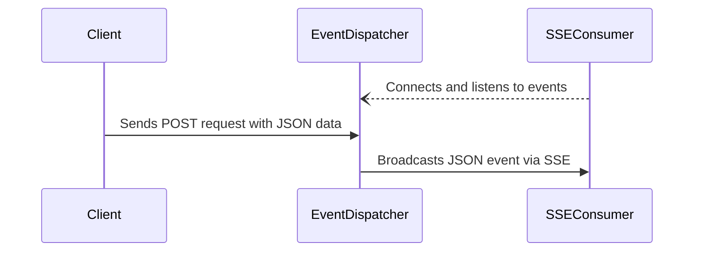

# Pillarbox Event Dispatcher


Pillarbox Event Dispatcher is a stateless Go microservice that receives JSON data via HTTP POST
requests and broadcasts the received events using Server-Sent Events (SSE) to multiple consumers.
This service facilitates real-time event streaming for clients, offering insights into system health
and behavior.

> [!IMPORTANT]
> What this service doesn't do
>
> - It does not store events, even temporarily.
> - None of the data is critical, so there's no mechanism for resend events that haven't been
    received *(if the data is being used to monitor products you consider critical, it's probably
    time to monitor those products instead)*.

## Quick Guide

**Prerequisites and Requirements**

- Go 1.23 or higher

**Setup**

1. Run the Application:
   ```bash
   go run cmd/event_dispatcher/main.go
   ```

**Available Endpoints**

- To send events via a `POST` request with a JSON payload, use the `/api/events` endpoint:
   ```bash
   curl -X POST http://localhost:8080/api/events \
        -H 'Content-Type: application/json' \
        -d "{\"msg\": \"data\", \"timestamp\": \"$EPOCHSECONDS\"}"
   ```

- To listen to events using SSE, connect to the `/events` endpoint:
   ```bash
   curl -n http://localhost:8080/events
   ```

- To check the health of the service, use the `/health` endpoint:
   ```bash
   curl http://localhost:8080/health
   ```

**Running with Docker**

Alternatively, you can build and run the application using Docker:

1. Build the Docker Image:
   ```bash
   docker build -t pillarbox-event-dispatcher .
   ```

2. Run the Docker Container:
   ```bash
   docker run -p 8080:8080 pillarbox-event-dispatcher
   ```

**Build Process with Makefile**

The project includes a `Makefile` to simplify building across multiple platforms. To see all
available commands, run:

```bash
make help
```

The binaries are output to the `dist` directory, and the build supports multiple platforms such as
`linux/amd64`, `linux/arm64`, `darwin/amd64`, and `darwin/arm64`.

## Documentation

This project is a Go microservice that accepts incoming JSON events via HTTP POST and broadcasts
them to clients using SSE. It operates in a stateless manner, without persisting events.

The system is designed to support real-time streaming without data storage or recovery mechanisms.

### System Flow Overview

The general flow of the service can be illustrated as follows:



### Continuous Integration

This project automates its development workflow using GitHub Actions across two main workflows:
quality checks and releases.

1. **Quality Check for Pull Requests**
   Triggered on every pull request to the `main` branch, this workflow ensures the code passes
   static analysis and unit tests. It guarantees that any new code meets quality standards before
   being merged into the main branch.

2. **Release Workflow**
   When changes are pushed to the `main` branch, this workflow handles versioning and releases using
   `semantic-release`. It automatically bumps the version, generates release notes, creates a tag,
   and publishes a Docker image to an Amazon ECR repository.

## Contributing

Contributions are welcome! Please follow the project’s code style and linting rules when
contributing. Here are some commands to help you get started:

Check your code style by running:

```bash
gofmt -l .
```

Apply the code style:

```shell
go fmt ./...
```

Test for common issues by running:

```shell
go vet ./...
```

All commits must follow the [Conventional Commits](https://www.conventionalcommits.org/en/v1.0.0/)
format to ensure compatibility with our automated release system. A pre-commit hook is available to
validate commit messages.

You can set up hook to automate these checks before commiting and pushing your changes, to do so
update the Git hooks path:

```bash
git config core.hooksPath .githooks
```

Refer to our [Contribution Guide](docs/CONTRIBUTING.md) for more detailed information.

## License

This project is licensed under the [MIT License](LICENSE).
